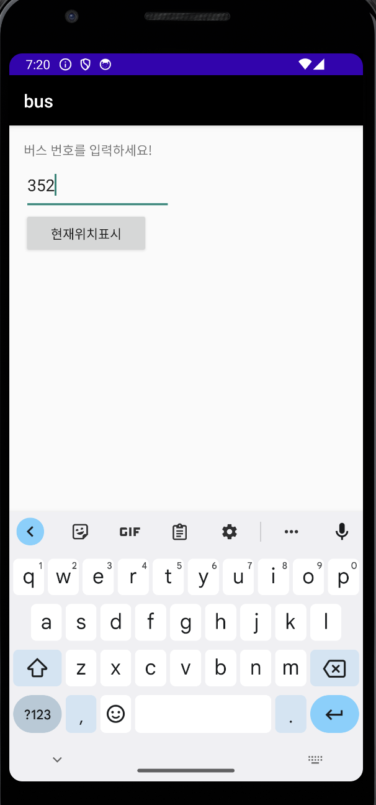
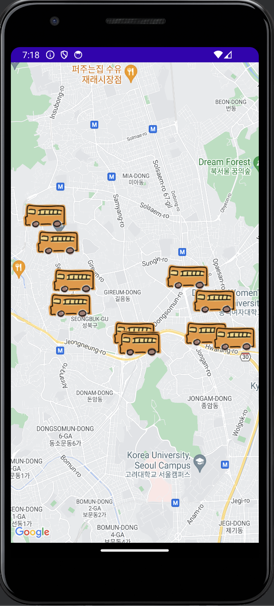

# 🚌 Bus Real-Time Tracker - 실시간 버스 위치 조회 앱

**Bus Real-Time Tracker**는 사용자가 **버스 번호를 입력**하면 해당 버스의 **실시간 위치**를 지도에 표시해주는 Android 애플리케이션입니다. 이 앱은 사용자가 대중교통 정보를 빠르게 확인하고, 현재 위치와 가장 가까운 버스를 파악할 수 있도록 돕습니다.

---

## 📱 주요 기능

1. **버스 번호 입력 및 검색**  
   - 사용자는 앱 상단의 입력 창에 **버스 번호**를 입력할 수 있습니다.
   - 버스 번호를 입력 후 **"현재 위치 표시"** 버튼을 클릭하면 지도에 해당 버스의 위치가 표시됩니다.

2. **지도 위 실시간 버스 위치 표시**  
   - 입력된 버스 번호에 해당하는 **버스들의 위치**가 지도 위에 아이콘으로 표시됩니다.
   - 사용자는 **Google Maps**를 통해 버스의 이동 경로와 인근 정류장 정보를 시각적으로 확인할 수 있습니다.

3. **현재 위치 표시 기능**  
   - 사용자의 **현재 위치를 지도에 표시**해 가장 가까운 버스와의 거리 및 방향을 파악할 수 있습니다.

---

## 🛠 기술 스택

- **Android Studio**: 앱 개발 환경
- **Google Maps API**: 지도 및 위치 서비스 연동
- **Real-Time Bus API**: 실시간 버스 위치 데이터 수집
- **Java**: Android 앱 개발 언어

---

## 📥 설치 및 사용 방법

1. 이 리포지토리의 APK 파일을 다운로드하여 **Android 기기에 설치**합니다.
2. **앱을 실행**하고, 검색 창에 버스 번호를 입력한 후 **"현재 위치 표시"** 버튼을 누릅니다.
3. 지도에 해당 버스의 실시간 위치가 표시되며, 사용자 위치와 가장 가까운 버스를 확인할 수 있습니다.

---

<<<<<<< HEAD
=======
## 🗺 앱 화면 예시

1. **버스 번호 입력 화면**  
   

2. **지도에 표시된 실시간 버스 위치**  
   

---
>>>>>>> f6aad5b (Reinitialize and update project files)
이 앱은 안드로이드 앱 프로그래밍 강의 과제로서 제작되었습니다!
